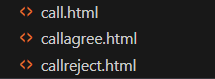
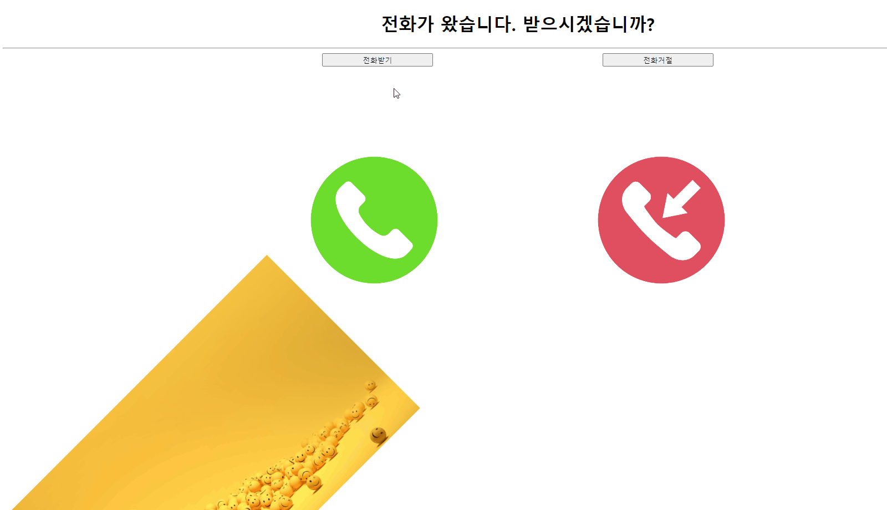

# 간단한 애니메이션 스타일

### 글자 색깔이 무지개 색으로 변하는 링크

```html
<!DOCTYPE html>
<html lang="en">
<head>
    <meta charset="UTF-8">
    <meta name="viewport" content="width=device-width, initial-scale=1.0">
    <title>Document</title>
    <style>
        /* keyframes :: 애니메이션을 생성하는 키워드*/
        @keyframes rainbow{

        0% { color: #ff2a2a; }

        15% { color: #ff7a2a; }

        30% { color: #ffc52a; }

        45% { color: #43ff2a; }

        60% { color: #2a89ff; }

        75% { color: #202082; }

        90% { color: #6b2aff; } 

        100% { color: #e82aff; }

        }
        a:hover{
            animation-duration: 2s;
            animation-name: rainbow;
            animation-iteration-count: infinite; 
        }
    </style>
</head>
<body>
    <a href="https://www.google.com"id="google"target="_blank">구글이동</a>
</body>
</html>
```

<figure><figcaption><p>마우스 올릴 시 색 변환</p></figcaption></figure>

### 전화 통화 모양의 애니메이션


<figure><figcaption><p>페이지 구성</p></figcaption></figure>

#### call.html

```html
<!DOCTYPE html>
<html lang="en">
<head>
    <meta charset="UTF-8">
    <meta name="viewport" content="width=device-width, initial-scale=1.0">
    <title>Document</title>
    <style>
      @keyframes moveLeftAnimation {
            0% {
                transform: scale(0.4) translateX(0);
            }
            25% {
                transform: scale(0.6) translateX(0);
            }
            50% {
                transform: scale(0.7) translateX(100px);
            }
            75% {
                transform: scale(0.6) translateX(0);
            }
            100% {
                transform: scale(0.4) translateX(0);
            }
        }

        @keyframes moveRightAnimation {
            0% {
                transform: scale(0.4) translateX(0);
            }
            25% {
                transform: scale(0.6) translateX(0);
            }
            50% {
                transform: scale(0.7) translateX(-100px);
            }
            75% {
                transform: scale(0.6) translateX(0);
            }
            100% {
                transform: scale(0.4) translateX(0);
            }
        }
        @keyframes movetextcall{
            0% {
                transform:translateX(0);
            }
            25% {
                transform: translateX(0);
            }
            50% {
                transform: translateX(100px);
            }
            75% {
                transform: translateX(0);
            }
            100% {
                transform: translateX(0);
            }


        }
        @keyframes movetextcall2{
            0% {
                transform:translateX(0);
            }
            25% {
                transform: translateX(0);
            }
            50% {
                transform: translateX(-100px);
            }
            75% {
                transform: translateX(0);
            }
            100% {
                transform: translateX(0);
            }


        }

        h1{
            text-align: center;
        }
        .call {
            animation: moveButtonAnimation 3s ease-in-out infinite;
            position: relative;
        }
        
        #callagree{
            
            animation: moveLeftAnimation 3s ease-in-out infinite; /* 애니메이션 적용 */

        }
        #callreject{
            
            animation: moveRightAnimation 3s ease-in-out infinite;
        }
        #movetextcall{
            animation: movetextcall 3s ease-in-out infinite
        }
        #movetextcall2{
            animation: movetextcall2 3s ease-in-out infinite
        }
        #box1, #box2 {
            text-align: center;
        }
        
        img.okay{
            animation: rotate_image 10s linear infinite;
            transform-origin: 50% 50%;
        }
        
        @keyframes rotate_image{
	    100% {
    	transform: rotate(360deg);
        
        }
        }
        img.happy:active{
            animation: rotate_image 10s linear infinite;
            transform-origin: 50% 50%;
            transform: rotate(360deg);
        }
        
    </style>
</head>
<body>
    <h1>전화가 왔습니다. 받으시겠습니까?</h1>
    <hr>
    
    <div id="box1">
    <button type="button"class="call"id="movetextcall" style="right:150px; width: 200px;" onclick="location.href='callagree.html'">전화받기</button>
    
    <button type="button"class="call"id="movetextcall2" style="left:150px; width: 200px;"onclick="location.href='callreject.html'">전화거절</button>
    </div>
    <br>
    <div id="box2">
    
    
    
    </div>
    <div>
        
        
    </div>

    
</body>
</html>

```

#### callagree.html

```html
<!DOCTYPE html>
<html lang="en">
<head>
    <meta charset="UTF-8">
    <meta name="viewport" content="width=device-width, initial-scale=1.0">
    <title>Document</title>
</head>
<body>
    <h1>전화 받기 성공</h1>
    
    
</body>
</html>
```

#### callreject.html

```html
<!DOCTYPE html>
<html lang="en">
<head>
    <meta charset="UTF-8">
    <meta name="viewport" content="width=device-width, initial-scale=1.0">
    <title>Document</title>
</head>
<body>
    <h1>전화거절하셨습니다.</h1>
    
</body>
</html>
```

<figure><figcaption><p>간단한 애니메이션</p></figcaption></figure>


