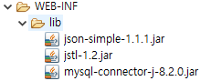

# 게임커뮤니티사이트

* /🗓️프로젝트 기간\[24.01.10\~24.02.16]

### 프로젝트 개요

<details>

<summary>📌개발 목적</summary>

게임을 즐기는 유저들의 소통공간을 만들고자 하였습니다.

</details>

<details>

<summary>🛠활용 도구</summary>


</details>

<details>

<summary>⚙️구성</summary>

JSON, JSTL.MYSQL을 사용하기 위해 외부 라이브러리를 받아옵니다.



각 라이브러리에 대한 설명입니다.

**1.json-simple.jar:** `json-simple`은 JSON 데이터를 다루기 위한 Java 라이브러리입니다. JSON은 JavaScript Object Notation의 약어로, 데이터를 효과적으로 교환하는 데 사용되는 경량의 데이터 교환 형식입니다. `json-simple.jar`는 JSON 데이터를 생성하고 파싱하는 데 도움이 되는 라이브러리입니다.

**2.jstl.jar (JavaServer Pages Standard Tag Library):** JSTL은 JavaServer Pages (JSP)에서 사용되는 표준 태그 라이브러리입니다. JSTL은 JSP 페이지에서 자주 사용되는 일반적인 작업들을 간편하게 처리하기 위한 태그들을 제공합니다. 예를 들어, 루프, 조건문, 데이터 포매팅 등을 처리하는 데 사용됩니다. `jstl.jar` 파일은 이러한 JSTL 태그들을 포함하고 있습니다.

**3.mysql-connector.jar:** `mysql-connector`는 MySQL 데이터베이스와 Java 어플리케이션 간의 연결을 지원하기 위한 JDBC(Java Database Connectivity) 드라이버입니다. Java 어플리케이션에서 MySQL 데이터베이스에 접근하고 데이터를 처리하는 데 사용됩니다. `mysql-connector.jar` 파일은 이 드라이버를 포함하고 있어서 Java 어플리케이션에서 MySQL과 상호 작용할 수 있게 해줍니다.

***

Controller, Command, PostCommand, DTO, DAO와 여러 html,jsp파일로 이루어져 있습니다.


***

</details>

<details>

<summary>📃중점 코드</summary>

#### server.xml

아래의 코드는 톰캣 server.xml 파일에서 Resource 요소를 지정해줘야 한다. 지정해주는 이유는 데이터베이스와 연동하기 위함이다. password는 제거하여 올렸습니다.

```xml
<Context docBase="gamecoummunity" path="/gamecommunity"  reloadable="true" source="org.eclipse.jst.jee.server:gamecoummunity">
			<Resource auth="Container" driverClassName="com.mysql.jdbc.Driver" name="jdbc/mysql" password="" type="javax.sql.DataSource" url="jdbc:mysql://localhost:3306/apidb" username="root"/>
			</Context>
			</Host>
		</Engine>
	</Service>
</Server>
```

#### ChatEndpoint.java

아래의 코드는 WebSocket를 사용하여 간단한 채팅을 구현하였습니다. 각각 다른 클라이언트 간에 실시간 채팅을 가능케 하였습니다. 클라이언트에서 WebSocket을 통해 서버에 접속해 메시지를 주고받을 수 있습니다.

```java
package com.project.Controller;

import java.io.IOException;
import java.util.Collections;
import java.util.HashSet;
import java.util.Set;

import javax.servlet.http.HttpSession;
import javax.websocket.EndpointConfig;
import javax.websocket.HandshakeResponse;
import javax.websocket.OnClose;
import javax.websocket.OnMessage;
import javax.websocket.OnOpen;
import javax.websocket.Session;
import javax.websocket.server.HandshakeRequest;
import javax.websocket.server.ServerEndpoint;
import javax.websocket.server.ServerEndpointConfig;

@ServerEndpoint(value = "/chat", configurator = ChatEndpoint.HttpSessionConfigurator.class)
public class ChatEndpoint {

    private static Set<Session> sessions = Collections.synchronizedSet(new HashSet<>());

    @OnOpen
    public void onOpen(Session session, EndpointConfig config) {
        HttpSession httpSession = (HttpSession) config.getUserProperties().get(HttpSession.class.getName());

        if (httpSession != null) {
            String userId = (String) httpSession.getAttribute("id");
            session.getUserProperties().put("userId", userId); 
            sessions.add(session);
            // 고유번호+ 아이디 
            //broadcast("User connected: " + userId + " (Session ID: " + userId + ")");
            // 아이디
            broadcast("User connected: " + userId);
        } else {
            System.out.println("HttpSession is null");
        }
    }

    @OnClose
//    public void onClose(Session session) {
//        sessions.remove(session);
//        broadcast("User disconnected: (Session ID: " + session.getId() + ")");
//    }
    public void onClose(Session session) {
        String userId = (String) session.getUserProperties().get("userId");
        sessions.remove(session);
        broadcast("User disconnected: " + userId);
    }

    @OnMessage
//    public void onMessage(String message, Session session) {
//        broadcast("[" + session.getId() + "] " + message);
//    }
    public void onMessage(String message, Session session) {
        String userId = (String) session.getUserProperties().get("userId");
        broadcast("[" + userId + "] " + message);
    }
//    public void onMessage(String message, String userId)
//    {
//       broadcast("[" + userId + "] " + message);
//    }

 // 이 메서드는 WebSocket 세션 목록에 있는 모든 세션에게 메시지를 브로드캐스트합니다.
    private void broadcast(String message) {
        // 세션 목록을 순회하며 각 세션에 메시지를 보냅니다.
        for (Session session : sessions) {
            try {
            	 //String userId = (String) session.getUserProperties().get("userId");
            	// 해당 세션에게 텍스트 메시지를 보냅니다.
                 session.getBasicRemote().sendText(message);
                
               // session.getBasicRemote().sendText(message);
            } catch (IOException e) {
                // 메시지 전송 중에 IOException이 발생하면 예외를 처리하고 콘솔에 출력합니다.
                e.printStackTrace();
            }
        }
    }


    // HttpSessionConfigurator class
    public static class HttpSessionConfigurator extends ServerEndpointConfig.Configurator {
        @Override
        public void modifyHandshake(ServerEndpointConfig sec, HandshakeRequest request, HandshakeResponse response) {
            // HttpSession을 가져와서 config에 저장
            HttpSession httpSession = (HttpSession) request.getHttpSession();
            sec.getUserProperties().put(HttpSession.class.getName(), httpSession);
        }
    }
}

```

아래는 메서드에 대한 설명입니다.

1. @ServerEndpoint(value = "/chat", onfigurator=ChatEndpoint.HttpSessionConfigurator.class)

WebSocket 서버 엔드포인트를 정의합니다. "/chat" 경로로 WebSocket 요청을 처리합니다. HttpSessionConfigurator를 사용하여 WebSocket 세션에 HttpSession을 연결합니다.&#x20;

onOpen(Session session, EndpointConfig config)

새로운 WebSocket 세션이 열릴 때 호출되는 메서드입니다. 연결된 HttpSession에서 사용자 아이디를 가져와서 WebSocket 세션의 사용자 속성에 저장합니다. 세션을 세션 목록에 추가하고, 사용자가 채팅에 참여했다는 메시지를 브로드캐스트합니다.

2. &#x20;onClose(Session session)

WebSocket 세션이 닫힐 때 호출되는 메서드입니다. 세션 목록에서 세션을 제거하고, 사용자가 채팅에서 나갔다는 메시지를 브로드캐스트합니다.&#x20;

3. onMessage(String message, Session session)

클라이언트로부터 메시지가 도착했을 때 호출되는 메서드입니다. 해당 세션에 연결된 사용자 아이디를 가져와서 메시지를 조합하고, 모든 세션에게 해당 메시지를 브로드캐스트합니다.

4. broadcast(String message)

세션 목록에 있는 모든 세션에게 메시지를 브로드캐스트하는 메서드입니다. HttpSessionConfigurator

WebSocket 세션에 HttpSession을 연결하기 위한 구성 클래스입니다. modifyHandshake 메서드를 사용하여 HttpSession을 가져와 WebSocket 세션 구성에 추가합니다.

***

#### mainboard.jsp
메인화면에서 사용한 채팅창 코드입니다.

```html
  대화창
             <div id="chat"></div>
    <input type="text" id="messageInput" onkeydown="handleKeyPress(event)" />
    <button onclick="sendMessage()"> Send</button>
    <script>
        const ws = new WebSocket("ws://localhost:8182/webTeamPJ/chat");

        ws.onopen = function(event) {
            appendMessage("대화를 입력해주세요");
        };

        ws.onmessage = function(event) {
            const message = event.data;
            appendMessage(message);
            //const userId = session.getAttribute("id");
            //appendMessage("[" + userId + "] " + message);
            
        };

        ws.onclose = function(event) {
            appendMessage("WebSocket connection closed");
        };

        // 메시지 전송
        function sendMessage() {
            const messageInput = document.getElementById("messageInput");
            const message = messageInput.value;

            ws.send(message);
            messageInput.value = "";
        }

        //메시지 출력
        function appendMessage(message) {
            const chatDiv = document.getElementById("chat");
            const messageDiv = document.createElement("div");
            messageDiv.textContent = message;
            chatDiv.appendChild(messageDiv);
            
            chatDiv.scrollTop = chatDiv.scrollHeight;
        }
        
        // 엔터 키 핸들링
        function handleKeyPress(event) {
            if (event.key === "Enter") {
                sendMessage();
                event.preventDefault(); // 엔터 키의 기본 동작(새 줄 추가)을 막습니다.
            }
        }
    </script>

```

#### PostDAO.java

게시물 관련 DAO 코드입니다. [작성,목록보기, 상세보기,검색,수정,삭제]
```java
package com.project.DAO;

import java.io.PrintWriter;
import java.sql.*;
import java.util.*;

import javax.naming.Context;
import javax.naming.InitialContext;
import javax.servlet.http.HttpServletRequest;
import javax.servlet.http.HttpServletResponse;
import javax.servlet.http.HttpSession;
import javax.sql.*;

import com.project.DTO.PostDTO;

public class PostDAO {
	private Connection conn = null;
	private PreparedStatement ps = null;
	private ResultSet rs = null;
	private DataSource ds = null;
	private Statement st = null;

	public PostDAO() {
		try {
			// JNDI를 사용하여 데이터 소스 설정
			Context ctx = new InitialContext();
			ds = (DataSource) ctx.lookup("java:comp/env/jdbc/mysql");
		} catch (Exception e) {
			System.out.println("PostDAO 생성자 에러");
			e.printStackTrace();
		}
	}

	public void Move(HttpServletRequest request, HttpServletResponse response) {
		HttpSession session = request.getSession(); // 기존 세션 가져오기
		session.setAttribute("newBoardList", null);
		session.setAttribute("BoardList", null);

	}

	// 게시물 작성
	public void PostInsert(String tag, String ID, String TITLE, String CONTENT, String FILE, String useridx, HttpServletRequest request,
			HttpServletResponse response) {
		try {
			// 비어 있는 항목을 기록할 변수 초기화
			List<String> emptyFields = new ArrayList<>();
			
			// 각 항목이 비어있는지 체크
			if (tag == null || tag.trim().isEmpty()) {
				emptyFields.add("태그");
			}
			if (TITLE == null || TITLE.trim().isEmpty()) {
				emptyFields.add("제목");
			}
			if (CONTENT == null || CONTENT.trim().isEmpty()) {
				emptyFields.add("내용");
			}

			// 어떤 항목이 비어 있으면 실패 페이지로 리다이렉트 및 JavaScript 경고창
			if (!emptyFields.isEmpty()) {
				
				String errorMessage = String.join(", ", emptyFields) + " (을)를 작성 하지 않았습니다.";

				// JavaScript 코드를 클라이언트에게 전달하기 위한 스크립트 작성
				String jsScript = "alert('" + errorMessage + "'); location.href = 'newPost.jsp';";

				// JavaScript 코드를 응답에 포함하여 클라이언트에게 전송
				response.setContentType("text/html;charset=UTF-8");
				PrintWriter out = response.getWriter();
				out.println("<script>" + jsScript + "</script>");
				out.close();
			} else {
				// DB 연결
				conn = ds.getConnection();

				// INSERT 쿼리 수행
				String query = "INSERT INTO board (tag, ID, TITLE, CONTENT, DATE, FILE, isgood, useridx) VALUES (?, ?, ?, ?, now(), ?, 0, ?)";
				ps = conn.prepareStatement(query);
				ps.setString(1, tag);
				ps.setString(2, ID);
				ps.setString(3, TITLE);
				ps.setString(4, CONTENT);
				ps.setString(5, FILE);
				ps.setString(6, useridx);
				

				try {
					ps.executeUpdate();
					System.out.println("게시물 작성 완료.");
					System.out.println("태그 : " + tag);
					System.out.println("작성자 아이디 : " + ID);
					System.out.println("글 제목 : " + TITLE);
					System.out.println("글 내용 : " + CONTENT);
					response.sendRedirect("succcessPosting.jsp");
				} catch (Exception e) {
					System.out.println("게시물 작성 실패 (catch).");
					String errorMessage2 = "로그인 후 작성해주세요.";
					String jsScript2 = "alert('" + errorMessage2 + "'); location.href = 'login.html';";
					response.setContentType("text/html;charset=UTF-8");
					PrintWriter out2 = response.getWriter();
					out2.println("<script>" + jsScript2 + "</script>");
					out2.close();
					// response.sendRedirect("login.html");
				}
			}
		} catch (Exception e) {
			System.out.println("Insert 쿼리 수행 실패");
			e.printStackTrace();
		}
	}

	// 게시물 목록
	public void PostList(HttpServletRequest request, HttpServletResponse response) {

		conn = null;
		st = null;
		rs = null;

		HttpSession session = request.getSession(true);
		session.setAttribute("boardList", null);
		try {
			conn = ds.getConnection();
			String Query = "select * from board order by IDX desc";
			ps = conn.prepareStatement(Query);
			rs = ps.executeQuery();
			List<Map<String, String>> boardList = new ArrayList<>();
			while (rs.next()) {
				Map<String, String> boardInfo = new HashMap<>();
				boardInfo.put("tag", rs.getString("tag"));
				boardInfo.put("title", rs.getString("TITLE"));
				boardInfo.put("idx", rs.getString("IDX"));

				boardList.add(boardInfo);
			}

			session.setAttribute("boardList", boardList);

			response.sendRedirect("ViewPost.jsp");
		} catch (Exception e) {
			System.out.println(e.toString());
			e.printStackTrace();
		} finally {
			try {
				if (rs != null) {
					rs.close();
				}
				if (st != null) {
					st.close();
				}
				if (conn != null) {
					conn.close();
				}
			} catch (Exception e2) {
				System.out.println(e2.toString());
				e2.printStackTrace();
			}
		}
	}

	// 게시물 상세 보기
	   public void detailPost(String IDX, HttpServletRequest request, HttpServletResponse response) {

	      conn = null;
	      st = null;
	      rs = null;

	      HttpSession session = request.getSession(true);

	      try {
	         conn = ds.getConnection();
	         String Query = "select * from board where IDX=?";
	         ps = conn.prepareStatement(Query);
	         ps.setString(1, IDX);
	         rs = ps.executeQuery();

	         if (rs.next()) {
	            List<Map<String, String>> DVPost = new ArrayList<>();
	            Map<String, String> detailPostMap = new HashMap<>();
	            detailPostMap.put("DPIdx", rs.getString("IDX"));
	            detailPostMap.put("DPTitle", rs.getString("TITLE"));
	            detailPostMap.put("DPContent", rs.getString("CONTENT"));
	            detailPostMap.put("DPId", rs.getString("ID"));
	            detailPostMap.put("DPDate", rs.getString("DATE"));
	            detailPostMap.put("DPTag", rs.getString("tag"));
	            detailPostMap.put("DPIsgood", rs.getString("isgood"));
	            detailPostMap.put("DPuseridx", rs.getString("useridx"));
	            System.out.println(session.getAttribute("useridx"));
	            DVPost.add(detailPostMap);
	            session.setAttribute("DPIdx", request.getParameter("DPIdx"));
	            session.setAttribute("DVPost", DVPost);
	            response.sendRedirect("detailPost.jsp");
	         }
	      } catch (Exception e) {
	         System.out.println(e.toString());
	         e.printStackTrace();
	      } finally {
	         try {
	            if (rs != null) {
	               rs.close();
	            }
	            if (ps != null) {
	               ps.close();
	            }
	            if (conn != null) {
	               conn.close();
	            }
	         } catch (Exception e2) {
	            System.out.println(e2.toString());
	            e2.printStackTrace();
	         }
	      }
	   }

	// 게시판 검색
	public List<PostDTO> searchPosts(String keyword) {
		List<PostDTO> result = new ArrayList<>();
		conn = null;
		ps = null;
		rs = null;

		try {

			// connection 객체 생성
			conn = ds.getConnection();

			// 게시글에서 제목 또는 내용에 키워드가 포함된 것을 검색하며, 결과를 IDX 기준으로 내림차순으로 정렬
			String query = "SELECT * FROM board WHERE title LIKE ? OR content LIKE ? ORDER BY IDX DESC";
			ps = conn.prepareStatement(query);
			ps.setString(1, "%" + keyword + "%");
			ps.setString(2, "%" + keyword + "%");
			rs = ps.executeQuery();
			while (rs.next()) {
				// 결과를 PostDTO 객체로 매핑하여 리스트에 추가
				PostDTO post = new PostDTO();

				post.setIDX(String.valueOf(rs.getInt("IDX")));
				post.setTag(rs.getString("tag"));
				post.setTITLE(rs.getString("TITLE"));
				post.setId(rs.getString("ID"));
				post.setCONTENT(rs.getString("CONTENT"));
				post.setDATE(rs.getString("DATE"));

				result.add(post);
			}
		} catch (Exception e) {
			System.out.println("게시판 검색 실패");
			e.printStackTrace();
		} finally {
			try {
				if (rs != null)
					rs.close();
				if (ps != null)
					ps.close();
				if (conn != null)
					conn.close();
				System.out.println("POSTDAO finally 통과");
			} catch (Exception e2) {
				System.out.println("객체 닫기 실패");
				e2.printStackTrace();
			}
		}
		System.out.println("좋았어postDAO 반환 전");
		System.out.println(result);
		return result;
	}

	public void PostMove(HttpServletRequest request, HttpServletResponse response) {

		conn = null;
		st = null;
		rs = null;

		HttpSession session = request.getSession(true);
		session.setAttribute("newBoardList", null);
		try {
			conn = ds.getConnection();
			String Query = "select * from board order by DATE desc";
			ps = conn.prepareStatement(Query);
			rs = ps.executeQuery();
			List<Map<String, String>> boardList = new ArrayList<>();
			while (rs.next()) {
				Map<String, String> boardInfo = new HashMap<>();
				boardInfo.put("tag", rs.getString("tag"));
				boardInfo.put("title", rs.getString("title"));
				boardInfo.put("idx", rs.getString("idx"));
				boardInfo.put("id", rs.getString("id"));
				boardInfo.put("date", rs.getString("date"));
				boardInfo.put("isgood", rs.getString("isgood"));

				boardList.add(boardInfo);
			}

			session.setAttribute("newBoardList", boardList);
		} catch (Exception e) {
			System.out.println(e.toString());
			e.printStackTrace();
		} finally {
			try {
				if (rs != null) {
					rs.close();
				}
				if (st != null) {
					st.close();
				}
				if (conn != null) {
					conn.close();
				}
			} catch (Exception e2) {
				System.out.println(e2.toString());
				e2.printStackTrace();
			}
		}
	}
	
	// 게시물 수정
	   public void PostUpdate(String tag, String ID, String TITLE, String CONTENT, String FILE, String IDX,
	         HttpServletRequest request, HttpServletResponse response) {
	      try {
	         // 비어 있는 항목을 기록할 변수 초기화
	         List<String> emptyFields = new ArrayList<>();

	         // 각 항목이 비어있는지 체크
	         if (tag == null || tag.trim().isEmpty()) {
	            emptyFields.add("태그");
	         }
	         if (TITLE == null || TITLE.trim().isEmpty()) {
	            emptyFields.add("제목");
	         }
	         if (CONTENT == null || CONTENT.trim().isEmpty()) {
	            emptyFields.add("내용");
	         }

	         // 어떤 항목이 비어 있으면 실패 페이지로 리다이렉트 및 JavaScript 경고창
	         if (!emptyFields.isEmpty()) {
	            String errorMessage = String.join(", ", emptyFields) + " (을)를 작성 하지 않았습니다.";

	            // JavaScript 코드를 클라이언트에게 전달하기 위한 스크립트 작성
	            String jsScript = "alert('" + errorMessage + "'); location.href = 'login.html';";

	            // JavaScript 코드를 응답에 포함하여 클라이언트에게 전송
	            response.setContentType("text/html;charset=UTF-8");
	            PrintWriter out = response.getWriter();
	            out.println("<script>" + jsScript + "</script>");
	            out.close();
	         } else {
	            // DB 연결
	            conn = ds.getConnection();

	            // INSERT 쿼리 수행
	            String query = "UPDATE board SET tag = ?, TITLE = ?, CONTENT = ?, DATE = now(), FILE = ? WHERE IDX = ?";
	            ps = conn.prepareStatement(query);
	            ps.setString(1, tag);
	            ps.setString(2, TITLE);
	            ps.setString(3, CONTENT);
	            ps.setString(4, FILE);
	            ps.setString(5, IDX);

	            try {
	               ps.executeUpdate();
	               System.out.println("게시물 수정 완료.");
	               System.out.println("태그 : " + tag);
	               System.out.println("작성자 아이디 : " + ID);
	               System.out.println("글 제목 : " + TITLE);
	               System.out.println("글 내용 : " + CONTENT);
	               response.sendRedirect("succcessPosting.jsp");
	            } catch (Exception e) {
	               System.out.println("게시물 수정 실패 (catch).");
	               String errorMessage2 = "로그인 후 작성해주세요.";
	               String jsScript2 = "alert('" + errorMessage2 + "'); location.href = 'updatePost.jsp';";
	               response.setContentType("text/html;charset=UTF-8");
	               PrintWriter out2 = response.getWriter();
	               out2.println("<script>" + jsScript2 + "</script>");
	               out2.close();
	               // response.sendRedirect("login.html");
	            }
	         }
	      } catch (Exception e) {
	         System.out.println("update 쿼리 수행 실패");
	         e.printStackTrace();
	      }
	   }

	   // 게시물 삭제
	   public void PostDelete(String IDX, HttpServletRequest request, HttpServletResponse response) {
	      conn = null;
	      ps = null;
	      rs = null;      
	      try {
	               // DB 연결
	               conn = ds.getConnection();

	               // INSERT 쿼리 수행
	               String query = "delete from board WHERE IDX = ?";
	               ps = conn.prepareStatement(query);
	               ps.setString(1, IDX);
	               ps.executeUpdate();
	               response.sendRedirect("main.doPosting");
	      } catch (Exception e) {
	         System.out.println("Delete 쿼리 수행 실패");
	         e.printStackTrace();
	      }
	   }
	}


```

#### PostServiceinsert.java
포스트 입력시 필요한 command 코드입니다.

```java
package com.project.PostCommand;

import java.io.ByteArrayOutputStream;
import java.io.InputStream;
import java.util.ArrayList;

import javax.servlet.http.HttpServletRequest;
import javax.servlet.http.HttpServletResponse;
import javax.servlet.http.HttpSession;
import javax.servlet.http.Part;

import com.project.DAO.PostDAO;
import com.project.DAO.UserDAO;
import com.project.DTO.PostDTO;
import com.project.DTO.UserDTO;

public class PostServiceInsert implements PostService {
    public ArrayList<PostDTO> execute(HttpServletRequest request, HttpServletResponse response) {
        ArrayList<PostDTO> dtoList = null;
        
        HttpSession session = request.getSession();
        // DAO에 있는 insert 메소드 수행
        PostDAO postDAO = new PostDAO();
        String tag = request.getParameter("tag");
        String nickname = (String)session.getAttribute("nickname");
        String TITLE = request.getParameter("TITLE");
        String CONTENT = request.getParameter("CONTENT");
        String USERIDX = (String)session.getAttribute("useridx");
        ByteArrayOutputStream buffer = new ByteArrayOutputStream();
        int nRead;
        byte[] data = new byte[1024];
        
        try {
           Part filePart = request.getPart("fileUpload");
           InputStream fileContent = filePart.getInputStream();
           
           while ((nRead = fileContent.read(data, 0, data.length)) != -1) {
                buffer.write(data, 0, nRead);
            }
           buffer.flush();
        }catch(Exception e) {
           e.printStackTrace();
        }
        
        byte[] fileBytes = buffer.toByteArray();
        
        // PostDAO 클래스의 PostInsert 메소드를 호출하여 사용자 정보를 데이터베이스에 삽입
        postDAO.PostInsert(tag, nickname, TITLE, CONTENT, fileBytes, USERIDX,request, response);

        return dtoList;
    }
}

//long blob로 테이블컬럼 수정해 최대 4기가파일까지 업로드 가능

```
#### PostCommandController.java
```java
package com.project.Controller;

import java.io.IOException;
import java.util.ArrayList;
import java.util.HashMap;
import java.util.List;
import java.util.Map;

import javax.servlet.RequestDispatcher;
import javax.servlet.ServletException;
import javax.servlet.annotation.WebServlet;
import javax.servlet.http.HttpServlet;
import javax.servlet.http.HttpServletRequest;
import javax.servlet.http.HttpServletResponse;
import javax.servlet.http.HttpSession;

import com.project.Command.UserService;
import com.project.Command.UserServiceDelete;
import com.project.Command.UserServiceFindID;
import com.project.Command.UserServiceFindPW;
import com.project.Command.UserServiceInsert;
import com.project.Command.UserServiceLogin;
import com.project.Command.UserServiceLogout;
import com.project.Command.UserServiceUpdate;
import com.project.DTO.PostDTO;
import com.project.PostCommand.DetailPost;
import com.project.PostCommand.PostService;
import com.project.PostCommand.PostServiceDelete;
import com.project.PostCommand.PostServiceInsert;
import com.project.PostCommand.PostServiceMove;
import com.project.PostCommand.ViewPost;
import com.project.PostCommand.PostServiceSearch;
import com.project.PostCommand.PostServiceupdate;

/**
 * Servlet implementation class PostCommandController
 */
@WebServlet("*.doPosting")
public class PostCommandController extends HttpServlet {
	private static final long serialVersionUID = 1L;

	/**
	 * @see HttpServlet#HttpServlet()
	 */
	public PostCommandController() {
		super();
		// TODO Auto-generated constructor stub
	}

	/**
	 * @see HttpServlet#doGet(HttpServletRequest request, HttpServletResponse
	 *      response)
	 */
	protected void doGet(HttpServletRequest request, HttpServletResponse response)
			throws ServletException, IOException {
		doPostingAction(request, response);
	}

	/**
	 * @see HttpServlet#doPost(HttpServletRequest request, HttpServletResponse
	 *      response)
	 */
	protected void doPost(HttpServletRequest request, HttpServletResponse response)
			throws ServletException, IOException {
		doPostingAction(request, response);
	}

	protected void doPostingAction(HttpServletRequest request, HttpServletResponse response)
			throws ServletException, IOException {
		request.setCharacterEncoding("UTF-8");
		String uri = request.getRequestURI();
		String conPath = request.getContextPath();
		String command = uri.substring(conPath.length());

		// View(jsp), Controller(프론트컨트롤러, 커멘드)
		PostService pService = null;
		UserService uService = null;
		HttpSession session = request.getSession(false);

		if (command.equals("/insert.doPosting")) {

			System.out.println("<게시물 작성>(을)를 수행합니다.");
			try {
				pService = new PostServiceInsert();
			} catch (Exception e) {
				e.printStackTrace();
			}
		} else if (command.equals("/viewPL.doPosting")) {
			System.out.println("<게시물 보기>(을)를 수행합니다.");
			pService = new ViewPost();
		} else if (command.equals("/search.doPosting")) {
			System.out.println("<게시판 검색>을 수행합니다.");
			pService = new PostServiceSearch();
			System.out.println("<게시판 검색>완료");

			// 여기에 추가: 검색 결과를 받아온 후, 결과를 request에 저장
			ArrayList<PostDTO> searchResult = (ArrayList<PostDTO>) pService.execute(request, response);
			request.setAttribute("postList", searchResult);

			// 여기에 추가: 검색 결과를 받아온 후, getLIst.jsp로 포워딩
			RequestDispatcher dispatcher = request.getRequestDispatcher("getList.jsp");
			dispatcher.forward(request, response);
		} else if (command.equals("/detail.doPosting")) {

			String selectIdx = request.getParameter("IDX");
			System.out.println(selectIdx);
			request.setAttribute("selectIdx", selectIdx);
			pService = new DetailPost();
		} else if (command.equals("/update.doPosting")) {
			pService = new PostServiceupdate();
		} else if (command.equals("/delete.doPosting")) {
			System.out.println("<게시글 삭제>를 수행합니다.");
			pService = new PostServiceDelete();
		} else if (command.equals("/FIFA.doPosting")) {
			System.out.println("<게시판 이동>을 수행합니다.");
			pService = new PostServiceMove();

			response.sendRedirect("FIFA.jsp");
		} else if (command.equals("/starcraft.doPosting")) {
			System.out.println("<게시판 이동>을 수행합니다.");
			pService = new PostServiceMove();

			response.sendRedirect("starcraft.jsp");
		} else if (command.equals("/LoL.doPosting")) {
			System.out.println("<게시판 이동>을 수행합니다.");
			pService = new PostServiceMove();

			response.sendRedirect("LoL.jsp");
		} else if (command.equals("/palworld.doPosting")) {
			System.out.println("<게시판 이동>을 수행합니다.");
			pService = new PostServiceMove();

			response.sendRedirect("palworld.jsp");
		} else if (command.equals("/maplestory.doPosting")) {
			System.out.println("<게시판 이동>을 수행합니다.");
			pService = new PostServiceMove();

			response.sendRedirect("maplestory.jsp");
		} else if (command.equals("/main.doPosting")) {
			System.out.println("<게시판 이동>을 수행합니다.");
			pService = new PostServiceMove();

			response.sendRedirect("mainboard.jsp");
		}
	
		
		
		pService.execute(request, response);
	}

}
```


</details>

<details>

<summary>🔎프로젝트 git 주소</summary>

[https://github.com/db-ung/web\_pj](https://github.com/db-ung/web\_pj)

</details>
