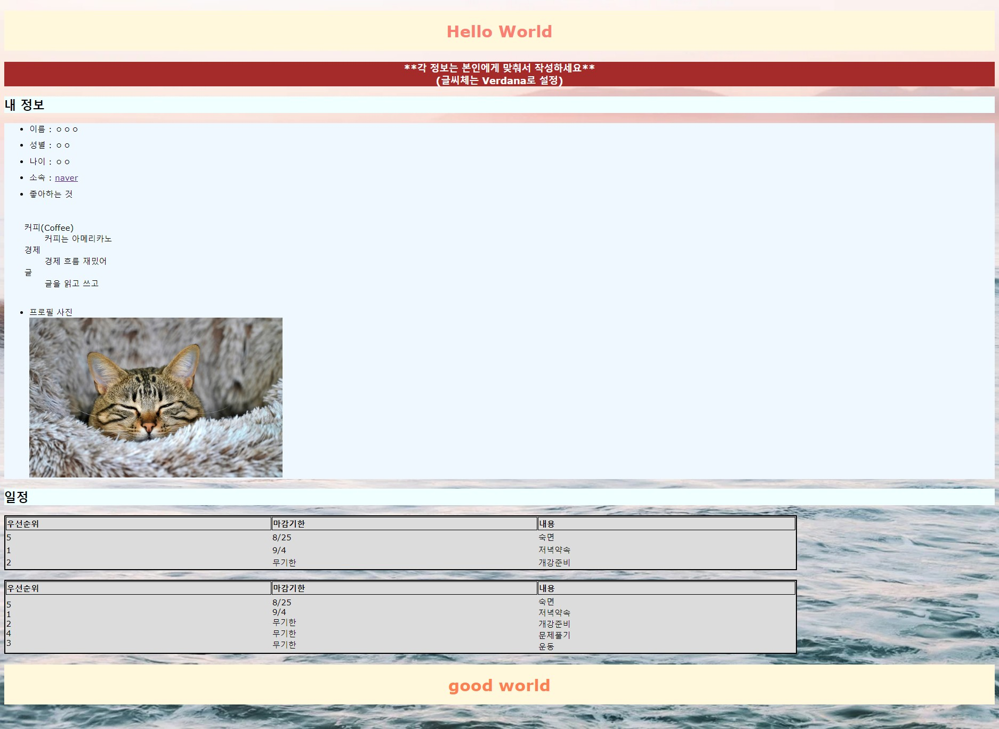

# HTML 활용한 간단한 페이지

간단한  페이지이므로타스일을 분리하지 않고 head 안에 삽입하였습니다.

````html
```html
<style>
        table{
            width: 80%;
            background-color: gainsboro;
            text-align:left; border: 3px solid;
        }
        th{
            border: 1px solid black;
        }
        body{
            background-image: url(https://cdn.pixabay.com/photo/2023/06/01/05/58/ocean-8032698_1280.jpg);
            background-repeat: no-repeat;
            background-size: cover;
            font-family: Verdana;            
        }
        h1{
            text-align: center;
            color: salmon;
            background-color: cornsilk;
            padding: 20px;
        }
        h2{
            background-color: azure;
        }
        h3{
            background-color: brown;
            color: white;
            text-align: center;
        }
        li{
            margin: 10px;
    
        }
        ul{
            background-color: aliceblue;
        }
    </style>
```
````

body의 코드와 결과물이다.&#x20;

```html
<body>
    <!-- 페이지 제목 -->
    <h1>Hello World</h1>

    <!-- 사용자 정보 섹션 -->
    <h3 style="font-family: Verdana;">**각 정보는 본인에게 맞춰서 작성하세요**<br>
        (글씨체는 Verdana로 설정)
    </h3>
    <h2 style="color: black;">내 정보</h2>
    <ul>
        <!-- 사용자 정보 항목들 -->
        <li>이름 : ㅇㅇㅇ</li>
        <li>성별 : ㅇㅇ</li>
        <li>나이 : ㅇㅇ</li>
        <li>소속 : <a href="https://www.naver.com" target="_blank">naver</a></li>
        <li>좋아하는 것</li><br>
        <!-- 좋아하는 것들을 정의 리스트로 나타냄 -->
        <dl>
            <dt>커피(Coffee)</dt>
            <dd>커피는 아메리카노</dd>
            <dt>경제</dt>
            <dd>경제 흐름 재밌어</dd>
            <dt>글</dt>
            <dd>글을 읽고 쓰고 </dd><br>            
        </dl>                
        <!-- 프로필 사진 -->
        <li>프로필 사진<br>
            
        </li>
    </ul>    
    
    <!-- 일정 섹션 -->
    <h2>일정</h2>
    <!-- 일정을 나타내는 테이블 -->
    <table>
        <!-- 테이블 헤더 -->
        <tr>
            <th>우선순위</th>
            <th>마감기한</th>
            <th>내용</th>
        </tr>
        <!-- 일정 항목들 -->
        <tr>
            <td>5</td>
            <td>8/25</td>
            <td>숙면</td>            
        </tr>
        <tr>
            <td>1</td>
            <td>9/4</td>
            <td>저녁약속</td>            
        </tr>
        <tr>
            <td>2</td>
            <td>무기한</td>
            <td>개강준비</td>            
        </tr>  
    </table>
    <br>
    <!-- 일정을 나타내는 두 번째 테이블 -->
    <table>
        <tr>
            <!-- 테이블 헤더 -->
            <th>우선순위</th>
            <th>마감기한</th>
            <th>내용</th>
        </tr>
        <tr>
            <!-- rowspan을 사용하여 여러 행을 병합 -->
            <td rowspan="5">5<br>1<br>2<br>4<br>3</td>
            <td rowspan="5">8/25<br>9/4<br>무기한<br>무기한<br>무기한</td>
            <td rowspan="5">숙면<br>저녁약속<br>개강준비<br>문제풀기<br>운동</td>            
        </tr>       
    </table>

    <!-- 스타일이 적용된 페이지 제목 -->
    <h1 style="background-color: cornsilk; color: coral; text-align: center;">good world</h1><br>              
</body>

```

<figure><figcaption><p>기초적인 사이트이다.</p></figcaption></figure>
