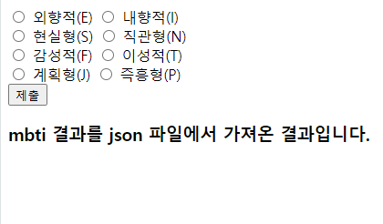

# MBTI 폼만들기

간단한 MBTI 폼입니다.

jquery를 이용하여 입력한 값을 json파일의 데이터와 일치하는 결과값을 가져와 웹페이지에 출력하는 형식을 구현하였습니다.

```html
<!DOCTYPE html>
<html lang="en">
<head>
    <meta charset="UTF-8">
    <meta name="viewport" content="width=device-width, initial-scale=1.0">
    <script src = "https://code.jquery.com/jquery-3.7.1.min.js"></script>
    <title>Document</title>
</head>
<body>
    <form id="mbtiform">
        <input type="radio" name="외향내향" id="E" value="E">    
        <label for="E">외향적(E)</label>
        <input type="radio" name="외향내향" id="I" value="I">
        <label for="I">내향적(I)</label><br>
        <input type="radio" name="현실직관" id="S" value="S">
        <label for="S">현실형(S)</label>
        <input type="radio" name="현실직관" id="N" value="N">
        <label for="N">직관형(N)</label><br>
        <input type="radio" name="감성이성" id="F" value="F">
        <label for="F">감성적(F)</label>
        <input type="radio" name="감성이성" id="T" value="T">
        <label for="T">이성적(T)</label><br>
        <input type="radio" name="계획즉흥" id="J" value="J">
        <label for="J">계획형(J)</label>
        <input type="radio" name="계획즉흥" id="P" value="P">
        <label for="P">즉흥형(P)</label><br>
    
        <button type="button" onclick="calculateMBTI()">제출</button>
    </form>
    <h3>mbti 결과를 json 파일에서 가져온 결과입니다.</h3>
    <p id="result"></p>
    <script>
            function calculateMBTI(){
             
        // 라디오 버튼 값 가져오기
        const 외향내향 = document.querySelector('input[name="외향내향"]:checked');
        const 현실직관 = document.querySelector('input[name="현실직관"]:checked');
        const 감성이성 = document.querySelector('input[name="감성이성"]:checked');
        const 계획즉흥 = document.querySelector('input[name="계획즉흥"]:checked');

        // 모든 라디오 버튼이 선택되었는지 확인
        if (!외향내향 || !현실직관 || !감성이성 || !계획즉흥) {
            alert("모든 항목을 선택하세요.");
            return;
        }

        // MBTI 계산
        const mbti = 외향내향.value + 현실직관.value + 감성이성.value + 계획즉흥.value;

        // 결과 출력
           
        alert(`당신의 MBTI는 ${mbti}입니다.`);          

        $.ajax({
            url:"https://jks92-bb.github.io/studyone/html/240104/mbti_info.json",
            method :"GET",
            dataType:"json",

            success:function(data){
                let para = $("#result")
                para.text(mbti+":"+data[mbti])
            },
            error:function(jqXHR,textStatus,errorThrown){
                console.log("error")
            }
        })
    }


    </script>
    

    
</body>
</html>
```

<figure><figcaption><p>mbti실행</p></figcaption></figure>

<details>

<summary>📚참고 자료</summary>

[Ajax관련 자료](https://www.nextree.co.kr/p4771/)

</details>
