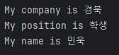

# 패키지 및 오버라이드


<details>

<summary>📖패키지(package)</summary>

관련된 클래스들을 그룹화하는 데 사용되는 디렉토리 구조를 나타내는 것이다.
장점
- 네임스페이스 분리 : 패키지를 사용하면 클래스들을 그룹화하여 동일한 이름의 클래스 충돌을 방지할 수 있습니다.
- 유지보수성 향상 : 프로젝트가 커지면서 클래싀 수가 증가하면 패키지를 사용하여 클래스를 논리적으로 구조화하여 유지보수를 용이하게 만들 수 있습니다.
- 접근 제어 : 패키지를 사용하면 클래스와 멤버들에 대한 접근을 제어할 수 있습니다.

</details>

<details>

<summary>📖오버라이드(override)</summary>

하위 클래스가 상위 클래스의 메서드를 재정의하는 개념이다. 
이를 행하는 것을 오버라이딩(overriding)이라고 한다.
- 상속관계 : 하위 클래스가 상위 클랫의 메서드를 상속받아 재정의
- 메서드 시그니처 동일성 : 오버라이딩할 메서드는 상위 클래스의 메서드와 이름,매개변수 타입 및 개수, 반환 타입 을 가져야 합니다.
- 접근 제어자 변경 : 하위 클래스에서 오버라이딩된 메서드의 접근 제어자는 상위 클래스의 메서드보다 더 넓은 범위로 변경할 수 있습니다.
  ex)  상위 클래스의 메서드가 protected이면 하위 클래스에서는 public으로 변경할 수 있습니다.
- super키워드 : 하위 클래스에서 오버라이딩된 메서드 내에서 상위 클래스의 메서드를 호출할 때 'super' 키워드를 사용해서 호출합니다.

</details>

### ex1]
```java
package com.kb;

public class BusinessMan extends Man {
    private String company; // 프라이빗으로 지정하여 main에서 고칠 수 없게 만들어 놓음.
    private String position;

    public BusinessMan(String company, String position, String name) {
        super(name);
        this.company = company;
        this.position = position;
    }

    @Override // 컴파일러에서 자동으로 사용되어지긴 가독성을 위해서 쓰는것이 낫다. 상위 클래스 정의를 재정의한 코드라고 알려주는 것.
    public void tellYourinfo() {
        System.out.println("My company is " + this.company);
        System.out.println("My position is " + this.position);
        super.tellYourinfo();
    }
}
```

위의 클래스는 패키지화 하였으며 아래의 클래스로 패키지안에 있는 클래스를 import하여 실행하였습니다.

```java
import com.kb.BusinessMan;

public class Operation {
    public static void main(String[] args) {
        BusinessMan businessMan = new BusinessMan("경북","학생", "민욱");
        
            businessMan.tellYourinfo();
        }
    }
```
***

### ex2]

최상위 클래스인 Friend와 상속받은 두 클래스 CompFriend, UnivFreind가 있으며 MyFriend1클래스를 활용해 출력하는 코드입니다.
```java

package com.kb;

//Friend 클래스 선언
public class Friend {
    // 멤버변수

    // String 이름
    private  String name;
    // String 전화번호
    private  String phone;

    //생성자 params : 이름, 전화번호.

    public Friend(String name, String phone) {
        this.name = name;
        this.phone = phone;
    }

    // 메소드명 : showInfo()
    public void showInfo(){
        System.out.println("이름 : "+this.name);
        System.out.println("전화 : "+this.phone);
    }

}

```

```java
package com.kb;

//클래스 생성
public class CompFriend extends Friend {
    // 멤버변수
    // string형 부서
    private String department;

    // 생성자 - params : 이름 , 부서 , 전화번호.
    public CompFriend(String name, String department, String phone) {// 변수 입력.
        super(name, phone);
        this.department = department;
    }

    // 메소드명 : showinfo()
    // 기능 : 이름, 부서 , 전화번호
    // 정보 출력 메서드 (오버라이딩)
    @Override
    public void showInfo() { //정보 표현
        super.showInfo();
        System.out.println("부서 : " + this.department);
    }
}

```

```java
package com.kb;

//클래스 생성
public class UnivFriend extends Friend {
    // 멤버변수
    // String형 전공.
    private String major;

    //생성자 - params : 이름, 전공, 전화번호.
    public UnivFriend(String name, String major, String phone) {//생성자 변수 기입.
        super(name, phone);
        this.major = major;
    }
    // 정보 표출 라인.
    // 메소드명 : showinfo()
    // 기능 : 이름, 전공, 전화번호 출력
     @Override
    public void showInfo() {
        super.showInfo();
        System.out.println("전공 :" + this.major);
    }
}
```

```java
// com.kb 패키지에서 Friend, UnivFriend, CompFriend 클래스를 import
import com.kb.CompFriend;
import com.kb.Friend;
import com.kb.UnivFriend;

// Java 내장 패키지인 java.util에서 ArrayList, List 클래스를 import
import java.util.ArrayList;
import java.util.List;

// MyFriend1 클래스 선언
public class MyFriend1 {
    public static void main(String[] args) {
       
        // Friend 타입을 담을 수 있는 List 객체 friendList 생성
        List<Friend> friendList = new ArrayList<>();

        // ufrns[ucnt]에 UnivFriend 객체 생성(lee, computer, 01011112222) 후 저장
        // friendList에 UnivFriend 객체들과 CompFriend 객체들을 추가
        friendList.add(new UnivFriend("lee", "computer", "01011112222"));
        friendList.add(new UnivFriend("seo", "electronics", "01011113333"));
        friendList.add(new CompFriend("yoon", "r&d 1", "01011114444"));      
        friendList.add(new CompFriend("youha", "r&d 2", "01011115455"));
        friendList.add(new CompFriend("soha", "r&d 3", "01011115557"));
        friendList.add(new CompFriend("jungha", "r&d 4", "01011115585"));


        // 반복 i 0부터 ucnt - 1 까지
        // - ufrns[i]의 showInfo() 실행
        // 반복문을 통해 friendList에 있는 객체들의 showInfo() 메서드 호출
        for (int i = 0; i < friendList.size(); i++) {
            friendList.get(i).showInfo();
        }
         // 강화된 for문을 통해 friendList에 있는 객체들의 showInfo() 메서드 호출
        for(Friend friend : friendList){
            friend.showInfo();
        }
    }
}

```


<figure><figcaption><p>콘솔 결과값</p></figcaption></figure>
