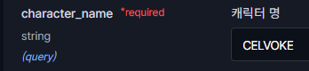
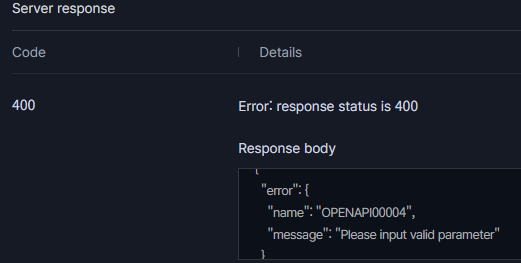

# NEXON Open API 이용하기


넥슨Open API 가이드


넥슨에서 제공하는 API로 여러 게임들의 정보를 이용하여 서비스를 개발할 수 있어 이용하였습니다.

API이용을 하기 위해서는 먼저 넥슨에 회원가입이 되어있어야 합니다. 일반적으로 게임을 즐겼던 사람이라면 넥슨에 회원가입은 되어 있을 것이라 예상되며 저 또한 가입이 되어 있어 서비스 이용을 바로 제공받을 수 있었습니다.

***

넥슨의 여러 게임 중 메이플스토리의 API를 이용하기로 하였습니다.

<figure><figcaption><p><a href="https://openapi.nexon.com/game/maplestory/?id=22">메이플스토리 API 가이드 바로가기</a></p></figcaption></figure>

가이드에서 제공하는 파이썬 샘플코드를 활용하여 학습하였습니다.

```python
headers = {
  "x-nxopen-api-key": "발급 받은 API Key"
}

characterName = "캐릭터명"
urlString = "https://open.api.nexon.com/heroes/v1/id?character_name=" + characterName
response = requests.get(urlString, headers = headers)

print(response.json())
```

캐릭터명이 존재함에도 오류가 발생하여 캐릭터 식별자(ocid) 값을 받아오지 못하는 경우가 있었는데, 예상하는 바로는 API에서 제공하는 정보가 2023년 12월 21일부터의 데이터이므로 23년 12월 21일부터 접속 이력이 없는 캐릭터에겐 식별자를 부여하고 있지 않은 것으로 보입니다.

<figure><figcaption><p>직접 있는 캐릭터명으로 확인해보았습니다.</p></figcaption></figure>

<figure><figcaption><p>오류 발생</p></figcaption></figure>

***

가설이 맞는지를 확인 하고자 직접 접속 후 테스트를 해보았습니다.
