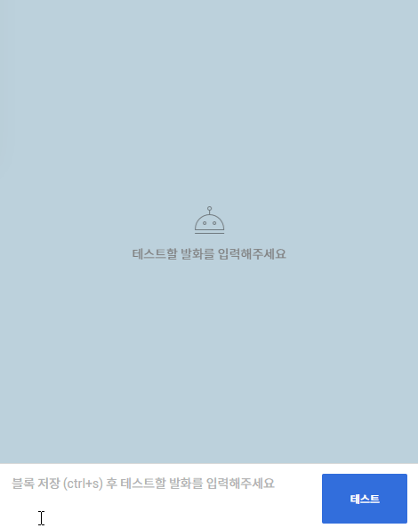

# NEXON Open API 이용하기


넥슨Open API 가이드


넥슨에서 제공하는 API로 여러 게임들의 정보를 이용하여 서비스를 개발할 수 있어 이용하였습니다.

API이용을 하기 위해서는 먼저 넥슨에 회원가입이 되어있어야 합니다. 일반적으로 게임을 즐겼던 사람이라면 넥슨에 회원가입은 되어 있을 것이라 예상되며 저 또한 가입이 되어 있어 서비스 이용을 바로 제공받을 수 있었습니다.

***

넥슨의 여러 게임 중 메이플스토리의 API를 이용하기로 하였습니다.

<figure><figcaption><p><a href="https://openapi.nexon.com/game/maplestory/?id=22">메이플스토리 API 가이드 바로가기</a></p></figcaption></figure>

가이드에서 제공하는 파이썬 샘플코드를 활용하여 학습하였습니다.

```python
headers = {
  "x-nxopen-api-key": "발급 받은 API Key"
}

characterName = "캐릭터명"
urlString = "https://open.api.nexon.com/heroes/v1/id?character_name=" + characterName
response = requests.get(urlString, headers = headers)

print(response.json())
```

캐릭터명이 존재함에도 오류가 발생하여 캐릭터 식별자(ocid) 값을 받아오지 못하는 경우가 있었는데, 예상하는 바로는 API에서 제공하는 정보가 2023년 12월 21일부터의 데이터이므로 23년 12월 21일부터 접속 이력이 없는 캐릭터에겐 식별자를 부여하고 있지 않은 것으로 보입니다.

<figure><figcaption><p>직접 있는 캐릭터명으로 확인해보았습니다.</p></figcaption></figure>

<figure><figcaption><p>오류 발생</p></figcaption></figure>

***

가설이 맞는지를 확인하고자 직접 접속 후 테스트를 해보았습니다.

<figure><figcaption><p>식별자 값 나타남</p></figcaption></figure>

접속 후에 같은 캐릭터명을 넣고 확인 결과 식별자 값이 나타나는 것을 볼 수 있었습니다.

***

제공하는 API를 활용하여 간단한 정보를 확인한 결과입니다.

<figure><figcaption><p>캐릭터의 간단한 정보</p></figcaption></figure>

***

이런 정보창을 확인하려면 사용자가 직접 코드를 실행해야 하기에 관련 지식이 없는 사용자가 확인 할 수 있도록 하기 위해서 카카오톡 챗봇도 추가하여 작업하였습니다.

```python
if result:
    # 여기에서 result를 이용하여 원하는 응답 생성
    response = {
        "version": "2.0",
        "template": {
            "outputs": [
                {
                    "basicCard": {
                        "thumbnail": {
                            "imageUrl": result['이미지']
                        },
                        "description": f"캐릭터명: {result['캐릭터명']}, 레벨: {result['레벨']}, 직업: {result['직업']}, 경험치 : {result['경험치']}%, 능력치 : {result['능력치']}"
                    }
                }
            ]
        }
    }
else:
    response = {"error": "캐릭터 정보를 찾을 수 없습니다."}
```

위의 코드로 챗봇에서 발화를 해보았으나 난잡하게 정보가 보입니다.

<figure><figcaption><p>카카오챗봇 응답 이미지</p></figcaption></figure>

아래의 코드를 사용하여 난잡하게 보인 결괏값을 알아보기 쉽게 변경하였습니다. 그리고 또한 테스트에서는 모든 응답 값이 넘어오는 것을 확인하였으나 폰에서 응답 결과가 모든 데이터를 받아오지 않는 것을 확인하였으며 확인 결과 데이터의 양의 초과하여 불필요한 데이터를 줄였습니다.

```python
if my_req:  # 만약 발화값이 비어있지 않다면
        # main 함수에서 반환된 결과를 사용
        result = main(my_req)  # 발화값을 main 함수에 전달
        if result:
    # 여기에서 result를 이용하여 원하는 응답 생성
            response = {
                "version": "2.0",
                "template": {
                    "outputs": [
                        {
                            "basicCard": {
                                "thumbnail": {
                                    "imageUrl": result['이미지']
                        },
                        "title": result['캐릭터명'],
                        "description": f"레벨: {result['레벨']}\n직업: {result['직업']}\n경험치: {result['경험치']}%\n"
                        + "\n".join([f"{stat.split(':')[0]}: {stat.split(':')[1]}" for stat in result['능력치']])
                    }
                }
            ]
        }
    }
        else:
            response = {"error": "캐릭터 정보를 찾을 수 없습니다."}
```

<figure><figcaption><p>수정된 응답 이미지</p></figcaption></figure>

***

그 전날의 경험치 변동도 확인하고자 코드를 추가하여서 테스트를 해보았습니다.

```python
 #추가코드
 day_before_yesterday = today - timedelta(days=2)
 
 def hello_maple()
 #추가코드
   f"경험치: {result['경험치']}% (어제 경험치 {result['경험치_변동']})\n" 
  
 def main(characterName)
 #추가코드
 # 어제와 엊그제 경험치 비교
        day_before_yesterday_exp = float(get_character_basic(ocid, day_before_yesterday.strftime("%Y-%m-%d")).get('character_exp_rate', '0'))
        yesterday_exp = float(get_character_basic(ocid, yesterday_date).get('character_exp_rate', '0'))
        result['경험치_변동'] = compare_exp(yesterday_exp, day_before_yesterday_exp) 
```

<figure><figcaption><p>경험치 변동사항 확인 가능</p></figcaption></figure>

잘 구동되고 _있는 것_ 같지만 그 전날 _레벨 업을_ 한 경우에서는 -% 경험치 변동이 뜨므로 그런 오류를 개선하기 위해서는 모든 레벨마다의 경험치 총량을 기입하여야 하고 비율이 아닌 총량으로 비교를 하는 방향으로 개선하여야 했습니다. 다음 개선에서 시도를 해보아야겠습니다.

<details>

<summary>🔎git 주소</summary>

[메이플 정보 챗봇](https://github.com/jks92-bb/studyone/tree/main/Python/maplechatbot)

</details>
