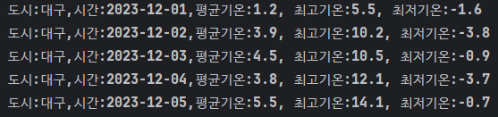
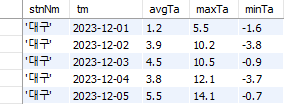

# 공공데이터 활용하여 날씨 정보 받아오기

<figure><figcaption>
Python 콘솔창
</figcaption></figure>

<figure><figcaption>
MySQL 테이블 정보
</figcaption></figure>

<figure><figcaption>
날씨정보로 받아온 결과값으로 만든 그래프
</figcaption></figure>
